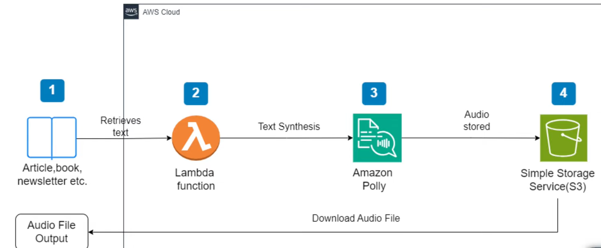
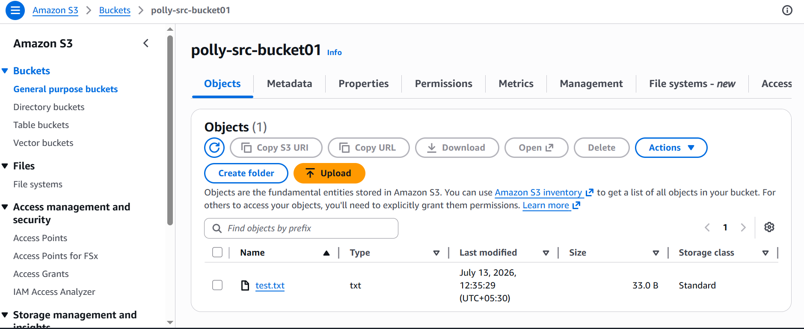
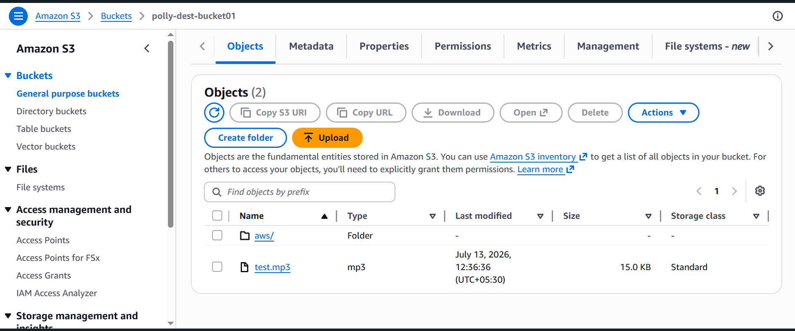
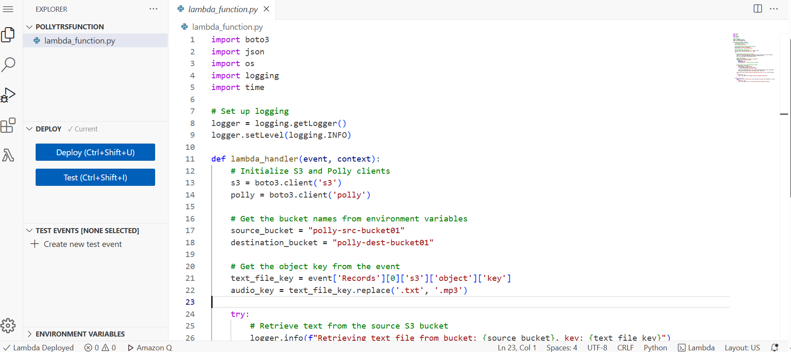

# 🎙️ AWS Polly Text-to-Speech Converter


---

# 📖 Project Overview

AWS Polly Text-to-Speech Converter is a **serverless cloud application** that automatically converts uploaded text files into speech. When a `.txt` file is uploaded to an Amazon S3 source bucket, an AWS Lambda function is triggered, which uses Amazon Polly to synthesize the text into an MP3 audio file and stores the generated output in a destination S3 bucket.

This project demonstrates how AWS managed services can be integrated to build an **event-driven serverless application**.

---

# 🏗️ Architecture Diagram




---

# 🛠️ AWS Services Used

| AWS Service | Purpose |
|-------------|---------|
| Amazon S3 | Stores input text files and generated MP3 files |
| AWS Lambda | Automatically executes the Python function |
| Amazon Polly | Converts text into speech |
| IAM | Provides secure permissions for Lambda |

---

# ✨ Features

- Automatically triggers Lambda when a text file is uploaded.
- Converts text into natural-sounding speech using Amazon Polly.
- Stores generated MP3 files in a destination S3 bucket.
- Event-driven serverless architecture.
- Developed using Python and the AWS SDK for Python (`boto3`).
- Generates execution logs for monitoring and troubleshooting.

---

# 🔄 Workflow

1. Upload a `.txt` file to the Source S3 bucket.
2. Amazon S3 triggers the AWS Lambda function.
3. Lambda reads the uploaded text file.
4. Amazon Polly converts the text into speech.
5. Lambda stores the generated `.mp3` file in the destination S3 bucket.
6. Download or play the generated audio file.

---

# 📂 Project Structure

```text
aws-polly-text-to-speech/
│
├── lambda_function.py
├── requirements.txt
├── README.md
├── .gitignore
│
└── screenshots/
    ├── architecture.png
    ├── source-bucket.png
    ├── destination-bucket.png
    ├── lambda-function.png
    └── lambda-code.png
```

---

# ⚙️ Prerequisites

- AWS Account
- Python 3.x
- Amazon S3
- AWS Lambda
- Amazon Polly
- IAM Role

---

# 🚀 Setup Instructions

### Step 1 – Create S3 Buckets

Create two Amazon S3 buckets:

- Source Bucket
- Destination Bucket

---

### Step 2 – Create Lambda Function

- Runtime: Python 3.x
- Upload the Python source code.

---

### Step 3 – Configure IAM Role

Grant permissions for:

- Amazon S3
- Amazon Polly
- CloudWatch Logs

---

### Step 4 – Configure Environment Variables

| Variable | Description |
|----------|-------------|
| SOURCE_BUCKET | Source S3 bucket name |
| DESTINATION_BUCKET | Destination S3 bucket name |

---

### Step 5 – Configure S3 Trigger

Configure the Source S3 bucket to trigger the Lambda function whenever a `.txt` file is uploaded.

---

### Step 6 – Test the Project

- Upload a text file.
- Wait a few seconds.
- Verify that the generated MP3 file appears in the destination bucket.

---

# 📸 Project Screenshots

## 📁 Source S3 Bucket



---

## 📁 Destination S3 Bucket



---


---

## 💻 Lambda Function Code



---

# 🚀 Future Improvements

- Support multiple Amazon Polly voices.
- Support multiple languages.
- Add SSML (Speech Synthesis Markup Language) support.
- Generate unique output filenames.
- Build a web interface using Amazon API Gateway and a frontend.

---

# 📚 Learning Outcomes

Through this project, I gained practical experience with:

- AWS Serverless Computing
- Amazon S3
- AWS Lambda
- Amazon Polly
- IAM Roles and Permissions
- Event-Driven Architecture
- Python (`boto3`)
- Cloud Automation

---

# 👨‍💻 Author

**Santhosh P S**

B.E. Computer Science and Engineering (Cybersecurity)

Passionate about Cloud Computing, AWS, Python, and Cybersecurity.

---

## ⭐ If you found this project helpful, consider giving it a Star!
